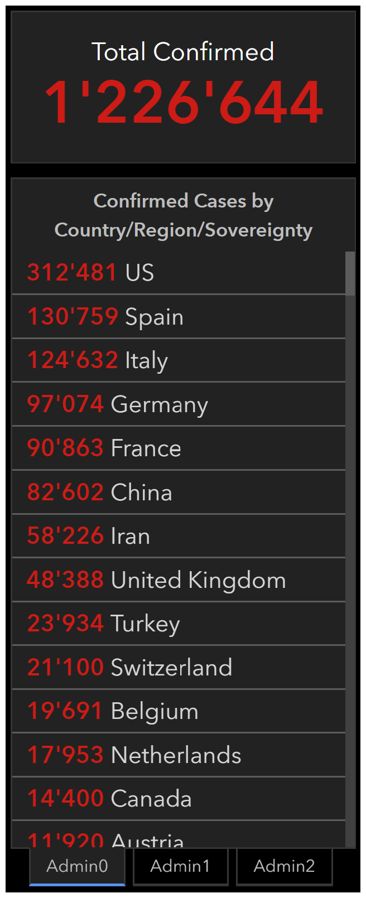

---

---

# PoC of Recommender System for safe and efficient Food Deliveries during Infectious Disease induced Lockdowns

Course "IBM Data Science"
Capstone Project, April 2020 by [Markus Mächler](https://www.linkedin.com/in/markus-maechler/)

## Introduction

Like many other countries all over the world, Switzerland is trying "flatten the curve" of COVID-19 infected people in order to make sure, that the local health system doesn't collapse. The **goal** of all the measures taken is to **prevent hospitals from having to treat a larger number of severe cases at the same time that they have the capacities for**.

In Switzerland we've been experiencing some major growth of COVID-19 cases in the last weeks. At the time I'm writing this introduction (April 5th 2020), despite drastic measures Switzerland still resides in the Top 10 countries considering total numbers of confirmed cases worldwide (see picture on the right[^1]).

The numbers for Switzerland become even more dramatic if you correct them for the number of inhabitants in each country. The Swiss having only about 8 million inhabitants, this translates to over 250 confirmed cases per 100'000 inhabitants. This is more than Italy and only slightly less than Spain.

**So corrected for the number of inhabitants, the Top 3 in the beginning of April 2020 are actually Spain, Switzerland and Italy.**

In this context, it makes more than sense for the federal government to call the situation "extraordinary".

> The Federal Council has categorised the situation in Switzerland as **extraordinary** under the terms of the Epidemics Act. It has issued a series of measures aimed at the population, organisations and institutions, and the cantons. These measures are designed to curb the spread of the new coronavirus, protect people at especially high risk, and assure the provision of care and therapeutic products to the public. [^2]

As a matter of fact there's currently a "lockdown" in place  and having seen from real world examples in China and Italy, the lockdown makes sense. As a part of that, all shops need to be closed. However, there are important exceptions:.

> The ban does not apply to the following establishments and events:
>
> - Food stores and other shops selling articles for everyday use (e.g. kiosks and petrol station shops)
> - Takeaway establishments, staff canteens, meal delivery services and restaurants for hotel guests
> - Pharmacies, drugstores and shops selling medical aids (e.g. eyeglasses and hearing aids)
> - ...[^2]

Everybody needs to stay at home unless it is absolutely necessary. Again, the federal government has provided clear exceptions.

> Stay at home. Only leave the home if absolutely necessary. That means:
>
> - If you have to purchase groceries.
> - If you have to go to the doctor’s or the pharmacy.
> - If you have to help someone.
> - If you are unable to work from home and you have to go to work.[^2]

The risk of  becoming a severe case and needing hospitalization is much higher for people over the age of 65 and/or having chronic illnesses and also other factors. The situation creates a dilemma for the people at risk. For "flattening the curve" to work, **people at risk should not leave home at all. If possible not even for basic shopping like getting food**.

In the small town where I live, I was able to sign up for a **neighborhood help program** so as a **helper** I can go shopping for people at risk. Again, for it to make sense, helpers should shop in the vicinity and also deliver in the vicinity of their homes. This safes both time as well as helps lowering the risk of spreading the virus infections over a big area.

Of course, we also have **another problem of economical nature**. There's bakeries, cafes, restaurants... that are either closed or only allowed to provide take-away service. Despite the financial aid the government provides, those businesses will not be able to survive if they see drops in numbers of customers for too long.

Wouldn't it be great to solve all those problems together? Namely:

1. keep people at risk **safe but not hungry**
2. keep shops and restaurants **up and running**
3. use helpers as **efficiently and safely** as possible

The purpose of this project is creating a small POC (proof of concept) to help tackling our three problems by creating a simple but efficient recommender system that could be used to place actual orders.

## Data

... *where you describe the data that will be used to solve the problem and the source of the data.*

In our scenario we have three parties:

1. **customer "C"** = person at risk ordering items
2. **shop "S"** = provider of the items e.g. take away restaurant, shop where items are to be purchased
3. **helper "H"** = home (or actual position) of helper that picks up the goods at the shop and delivers them to the customer

#### Location Data

For every order, **location data of all the three parties** is absolutely necessary. For this POC I'm using the following data sources.

- C: **hypothetical address of a customer in Zurich**
- H: **hypothetical addresses in Zurich**
- S: **Foursquare location data** acquired via API in the vicinity of people at risk

#### Additional Data

Then, also additional data will be important to make good recommendations for both shops and helpers.

customers:

- preferences like type of food (hypothetical)

shops:

- covid-19 conform take away service (hypothetical)
- rating (Foursquare API)
- type (Foursquare API)

helpers:

- rating (hypothetical)
- last test COVID-19 negative (hypothetical)
- immunity COVID-19 (hypothetical)
- availability status (hypothetical)

## Methodology

...*Methodology section which represents the main component of the report where you discuss and describe any exploratory data analysis that you did, any inferential statistical testing that you performed, if any, and what machine learnings were used and why.*

### what we want to optimize

- minimize total distance helper has to travel

assumptions:
- the position of our customer (C) is fixed.
- distances measured in air-line distance (may in some cases where street topology is special not lead to the ultimate best decisions, e.g. elevation ignored or dead end streets)

variables to measure distances the helper has to travel:
1. __HtoS__ = distance from the helper (H) to the shop (S)
2. __StoC__ = distance from shop (S) to customer (C)
3. __CtoH__ = distance from customer (C) to shop (S)

for the travel distance and time of our helper to be minimized we need to minimze the sum of our variable 1 to 3 (HtoS+StoC+CtoH = __totDis__)

### Let's first visualize the problem we try to solve:

So by looking at these three possible combinations of helpers and shops we can state the following:

- (3) is obviously a bad choice, since totDis is significantly larger than for the other two examples.
- (2) has the shortest totDis and would therefore take our helper 3 the least amount of time.
- (1) has a larger totDis but has the advantage that the distance from the shop to the customer is less than a third when compared to (2)

So (2) is the solution, right? 

Not necessarily. Consider that the item that needs to be purchased is refrigerated, e.g. a kind of medication that degrades when getting to warm. Or the customer orders something really heavy like a sixpack of water.

In both cases (1) would make more sense than (2) even if totDis is larger.

In the first example the medication would potentially get too warm and renderd useless. In the second example the helper would have a hard time lifting the items a long way.

### Weighting

A possible solution to make better recommendations would be to introduce weighting. To address our two real-world examples we could use weights for cases:

- do items need to be refrigerated?
- are heavy items included?

For both cases StoC would receive higher weights than in a standard case.

## Results

Results section where you discuss the results.

## Discussion

Discussion section where you discuss any observations you noted and any recommendations you can make based on the results.

## Conclusion 

Iterative

centralized or not

extend to other items such as medication, contact lenses...

embed in a order system where helpers get requests and are able to accept or deny orders and shops also get notified. Depending on the shop either the helpers go shopping or there is staff in the shops that prepares the order and the helpers simply fetch and deliver it.

blacklists of helpers and customers

Footnotes

[^2]: https://www.bag.admin.ch/bag/en/home/krankheiten/ausbrueche-epidemien-pandemien/aktuelle-ausbrueche-epidemien/novel-cov/massnahmen-des-bundes.html#-14035597
[^1]:https://gisanddata.maps.arcgis.com/
