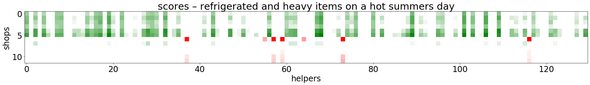

---

---

# PoC – Recommender System for safe and efficient Food Deliveries during Infectious Disease induced Lockdowns

Course "IBM Data Science" – Professional Certificate
Capstone Project, April 2020 by [Markus Mächler](https://www.linkedin.com/in/markus-maechler/)

## Introduction

Like many other countries all over the world, Switzerland is trying "flatten the curve" of COVID-19 infected people in order to make sure, that the local health system doesn't collapse. The **goal** of the drastic measures is to **prevent hospitals from simultaneously having to treat a larger number of severe cases than they have the capacities for**.

In Switzerland we've been experiencing some major growth of COVID-19 cases in the last weeks. At the time I'm writing this introduction (April 5th 2020), and despite drastic measures, Switzerland still resides in the top 10 countries considering total numbers of confirmed cases worldwide.

The numbers for Switzerland appear even more dramatic if you correct them for the number of inhabitants in each country. For the Swiss having only about 8 million inhabitants, this translates to over 250 confirmed cases per 100'000 inhabitants. This is more than Italy and only slightly less than Spain.

**So corrected for the number of inhabitants, the top 3 in the beginning of April 2020 are actually Spain, Switzerland and Italy.**

In this context, it makes more than sense for the federal government to call the situation "extraordinary".

> The Federal Council has categorised the situation in Switzerland as extraordinary under the terms of the Epidemics Act. It has issued a series of measures aimed at the population, organisations and institutions, and the cantons. These measures are designed to curb the spread of the new coronavirus, protect people at especially high risk, and assure the provision of care and therapeutic products to the public. [^2]

As a matter of fact there's been a quite severe "lockdown" in place for weeks. Having seen real world examples like in China and Italy, the lockdown makes sense. As a part of that, all shops need to be closed. However, there are important exceptions:.

> The ban does not apply to the following establishments and events:
>
> - Food stores and other shops selling articles for everyday use (e.g. kiosks and petrol station shops)
> - Takeaway establishments, staff canteens, meal delivery services and restaurants for hotel guests
> - Pharmacies, drugstores and shops selling medical aids (e.g. eyeglasses and hearing aids)
> - ...[^2]

Everybody needs to stay at home unless it is absolutely necessary. Again, the federal government has provided clear exceptions.

> Stay at home. Only leave the home if absolutely necessary. That means:
>
> - If you have to purchase groceries.
> - If you have to go to the doctor’s or the pharmacy.
> - If you have to help someone.
> - If you are unable to work from home and you have to go to work.[^2]

The risk of  becoming a severe case and needing hospitalization is much higher for people over the age of 65 and/or having chronic illnesses and also other factors. So the situation creates a dilemma for the people at risk. For "flattening the curve" to work, **people at risk should not leave home at all. If possible not even for basic shopping like getting food**.

In the small town where I live, I was able to sign up for a **neighborhood help program** so as a **helper** I can go shopping for people at risk. Again, for it to make sense, helpers should shop in the vicinity and also deliver in the vicinity of their homes. This safes both time as well as helps lowering the risk of spreading the virus infections over a big area.

Of course, we also have **another problem of economical nature**. There's bakeries, cafes, restaurants... that are either closed or only allowed to provide take-away service. Despite the financial aid the government provides, those businesses will not be able to survive if they see drops in numbers of customers for too long.

Wouldn't it be great to solve all those problems together? Namely:

1. keep people at risk **safe but not hungry**
2. keep shops and restaurants **up and running**
3. use helpers as **efficiently and safely** as possible

At the time I'm finishing this project (end of April) lockdown measures are starting to get loosened slowly. Certain types of shops are allowed to open again and the government is monitoring the numbers to make a decision on how to proceed.

**Either way, it will probably still take considerably more time for our persons at risk to be allowed to go back to normal life.** Also restaurants are not part of the shops that are allowed to reopen soon. So while tension lifted somehow, the aforementioned problems still exist. Also other parts of the world aren't as far progressed yet. And of course, overwhelming infection rates can always come back, or we can be hit by some other pandemic altogether.

**The purpose of this project is creating a small POC (proof of concept) to help tackling our three problems by creating a simple but efficient recommender system that could be used to place actual orders.**

## Data

In our scenario we have three parties:

1. **customer "C"** = person at risk ordering items
2. **shop "S"** = provider of the items e.g. take away restaurant, shop where items are to be purchased
3. **helper "H"** = home (or actual position) of helper that picks up the goods at the shop and delivers them to the customer

#### Location Data

For every order, **location data of all the three parties** is absolutely necessary.
For this PoC I'm using the following data sources.

- **C: hypothetical customer address and realtime weather data in Zurich**
  
  - To have something to start working with, I simply picked a *random address somewhere in Zurich Höngg (mail code 8049).
  
    ```python
    custAddr = 'Gsteigstrasse 9, 8049 Zurich'
    ```
  
  - The *openweathermap.org API* was used to get a json file including *local temperature* data.
  
    ```json
    {'coord': {'lon': 8.5, 'lat': 47.4},
     'weather': [{'id': 500,
       'main': 'Rain',
       'description': 'light rain',
       'icon': '10d'}],
     'base': 'stations',
     'main': {'temp': 19.93,
      'feels_like': 16.91,
      'temp_min': 18.33,
      'temp_max': 21,
      'pressure': 1008,
      'humidity': 32},
     'visibility': 10000,
     'wind': {'speed': 2.1, 'deg': 40},
     'rain': {'3h': 0.33},
     'clouds': {'all': 95},
     'dt': 1587910061,
     'sys': {'type': 1,
      'id': 6941,
      'country': 'CH',
      'sunrise': 1587874624,
      'sunset': 1587925808},
     'timezone': 7200,
     'id': 2658017,
     'name': 'Werdhölzli',
     'cod': 200}
    ```
  
- **H: hypothetical locations in Zurich**
  
  - I queried the **Swiss search engine "search.ch"** – where you can also look for addresses and phone numbers – for addresses with mail code 8049.
  - Out of the page content I created a csv.
  - The **csv** was then **anonymized** and **enriched with automatically generated fake email addresses** with the **Faker library**.
  - result is a data frame with **130 unique helpers**:
  
  additionally: helper trolleys
  
  -  some of the helpers have **shopping trolleys** that help with the transport of heavy and/or refrigerated items
  - I created a random **one hot encoded matrix** with **about 20 %** of the helpers having a trolley.
  
- **S: Foursquare location data** acquired via API in the vicinity of people at risk
  
  - I queried for the following **venue categories**:
      - Food – 4d4b7105d754a06374d81259
    - Food & Drink Shop – 4bf58dd8d48988d1f9941735
    - Fruit & Vegetable Store – 52f2ab2ebcbc57f1066b8b1c
    - Market – 50be8ee891d4fa8dcc7199a7
    - Pharmacy – 4bf58dd8d48988d10f951735
    - Shopping – Mall 4bf58dd8d48988d1fd941735
  - **maximum StoC**:
      - **1'000 meters**
      - Rationale: A normal healthy young human walks at about 4 km/h by foot. So in 15 minutes the helper would travel 1 kilometer (=1000 meters). That's a reasonable number in a city like Zurich, where one has plenty of shopping possibilities. In rural areas one would probably consider cars or bicycles as the transport way of choice and would also need to apply a larger radius.
  - result is a dataframe with 12 shops:
  

## Methodology

**Nominatim geolocator** was used to convert addresses to geolocations, and for distance calculations **geopy**.

For both helpers and venues I used **pandas** data frames to store the data and **numpy** for working with weight  and score matrices.

The heat maps were produced with **matplotlib** and the interactive maps with **folium**.

### exploratory data analysis

To get a feeling for the distribution of the locations of shops, helpers and our customer, a map is very helpful. I therefore created a function that creates a folium map with the positions of our three parties.

color scheme:

- customer = red circle

- helpers = blue dots

- shops = green dots


This looks pretty nice. There are lots of helpers around. The shops are not evenly distributed at all, which just represents reality. Shops tend to be at locations, where lots of potential customers are roaming. Here, the majority of the shops are located at "Limmattalstrasse" and "Regensdorferstrasse".

Looking at the map as a human being it's quite obvious now to recommend our customer to order at **"Marcello's Bistro"** (green dot west of red circle) or **"Pizzeria Rapido"** (green dot south of red circle). There are also quite a few potential helpers who live both near the bistro / pizzeria and the customer.

However, our customer may not like the food Marcello's Bistro produces etc., choices may not be that obvious or there simply could be too many requests for a person to process by phone.

We would like to **automate such decisions.**

Ideally we can also introduce various **parameters, that influence a decision**, in the process.

So now here our recommender system comes into place.

### what do we want to optimize?

- **minimize total distance helper has to travel**

assumptions:
- distances measured in **air-line distance**

variables to measure distances the helper has to travel:
1. __HtoS__ = distance from the helper (H) to the shop (S)
2. __StoC__ = distance from shop (S) to customer (C)
3. __CtoH__ = distance from customer (C) to shop (S)

For the travel distance and time of our helper to be minimized we need to minimize the sum of our variables 1 to 3 (HtoS+StoC+CtoH = __totDis__)

### let's visualize the problem we're trying to solve:


So by looking at these three possible combinations of helpers and shops we can state the following:

- (3) is obviously a bad choice, since totDis is significantly larger than for the other two examples.
- (2) has the shortest totDis and would therefore take our helper 3 the least amount of time.
- (1) has a larger totDis but has the advantage that the distance from the shop to the customer is less than a third when compared to (2)

So (2) is the solution, right? 

Not necessarily. **Consider that the item (that needs to be purchased) is refrigerated**, e.g. a kind of medication that degrades when getting too warm. **Or the customer orders something quite heavy** like a six pack of water.

In both cases (1) would make more sense than (2) even if totDis is significantly larger.

In the first example the medication would potentially get too warm and rendered useless. In the second example the helper would have a hard time lifting the items over a long distance.

### distance calculation

Having latitudes and longitudes for all parties in place I used `geopy.distance.distance().m` to calculate distances in meters.

#### descriptive statistics

To get a feel for the calculated distance distribution I used **heat-maps and descriptive statistics**.

I defined the following custom color map for that purpose:

```python
greenToRed=LinearSegmentedColormap.from_list('gr',["g", "w","w","w","w","w", "r"], N=128)
```

This way the **color range from green to red is separated by 5 segments of white** to get a better feel for the extreme values. Green representing the lowest and red the highest values.

##### HtoS – distances between helpers and shops

```python
minmax=(66.0, 2997.0), mean=1020.1544871794872, variance=347400.27566939685, skewness=0.6169407691028028, kurtosis=-0.05635316670094914
```


The closest shop to a helper is only 66 meters away, mean distance is about 1 km and variance is obviously very high.

The shop with index 6 seems to be the one that is furthest away from some of the helpers. If you have a look a the venues data frame, you see that this is "Restaurant Turbinenhaus". If you look on the map, you can see it's located at the bottom right of the map and therefore naturally far away from helpers on the top left.

##### StoC – distances between shops and customers

```python
minmax=(105.0, 957.0), mean=482.5833333333333, variance=99210.08333333334, skewness=0.3728582113979914, kurtosis=-1.475914078451692
```


We get a good picture of possible shop recommendations here. The shop with index 6 also seems to be far away from our customer. It probably won't make it into our recommendation list, then.

Shops 5,4 and 1 could be potentially interesting, especially if the shop has to be near to the customer.

##### CtoH – distances between our customer and our helpers

```python
minmax=(105.0, 2080.0), mean=876.6769230769231, variance=306164.14287418005, skewness=0.6655659563462873, kurtosis=-0.6208715228192303
```


There are quite a few helpers located close to our customer, which is promising. Others are probably too far away.

##### totDist – total distance

```
minmax=(281.0, 6034.0), mean=2379.4070512820513, variance=1379222.639206181, skewness=0.5854207297337536, kurtosis=-0.2367640214900928
```


Again, we can clearly see that "Restaurant Turbinenhaus" with index 6 will not be a good recommendation. Also the helpers, that are too far away seem to be out of the game when we look at total distance.

### weighting

A **possible solution to make more meaningful recommendations is to introduce weighting**. To address our 2 real-world examples we could use weights for real world use cases:

- do items need to be **refrigerated**?
- are **heavy items** included?
- does the helper have a **shopping trolley**?

For both cases StoC would receive higher weights than for the standard case.

#### function to create weight matrix

Warning: Tuning of the following parameters is based on (somewhat educated) guesses, not sound science.

```python
# function that returns a weight matrix depending on the weather, items purchased and equipment of the helper
def returnWeights (temperature, isRefrigerated=False, isHeavy=False):
    
    # array structure 
    # for weights[HtoS, StoC, StoC_T, CtoH, totDist] -> "_T" means that helper has a trolley
    w_standard = np.array([0, 0, 0, 0, 10]) # total distance gets optimized, rest omitted
    
    if temperature>30: # StoC gets weighted more the hotter it is (for refrigerated items),
                       # for the helper having a trolley (with a thermos bag) helps to keep the goods cold
        w_refrigerated = np.array([0, 20, 10,  0, 0])
    elif temperature>25:
        w_refrigerated = np.array([0, 10, 5, 0, 0])
    elif temperature>15:
        w_refrigerated = np.array([0, 4, 2, 0, 0])
    else:
        w_refrigerated = np.array([0, 2, 1, 0, 0])

    # StoC gets weighted more for heavy items (3) and even more so if the helper has no trolley (8)
    w_heavy = np.array([0, 20, 10, 0, 0])
    
    # calculate total weight by adding the subweights
    w_total = w_standard + isRefrigerated*w_refrigerated + isHeavy*w_heavy

    # calculate and return normalized weight matrix where all weights sum up to 1
    w_total = w_total / w_total.sum()
    return w_total
```

I let this function run on 26th of April where the temperature reported by the openweathermap.org API was **a little below 20 degrees Celsius**. The function is **normalized** in a way that the **sum of all weights is always equal to 1**. 

It generated the following weight matrices:

```
Now we have a look at what weights are applied when we alter our variables

First we're getting the current temperature:
temperature at customer location: 19.93 °C

[HtoS  StoC StoC_T CtoH totDis]
[0.000 0.000 0.000 0.000 1.000] -> standard case
[0.000 0.500 0.250 0.000 0.250] -> heavy items
[0.000 0.250 0.125 0.000 0.625] -> refrigerated items with today's weather
[0.000 0.571 0.286 0.000 0.143] -> heavy and refrigerated item on a hot summer day
```

So in this setting **total distance gets less weight and the distance from the shop to the customer gets more weight under certain conditions**. Just like we wanted to.

It's also obvious that HtoS and CtoH have no relevance at all in our current setting. So we might as well leave it out completely. But because future relevant use cases might bring importance to those, I decided to keep those in the calculations. Especially since it's taking hardly any computational power.

So the final missing piece to get to scores are the following 2 functions:

```python
def calcScores(HtoS, StoC, CtoH, totDist, weights, hTrolley):
    w_HtoS=weights[0]
    w_StoC=weights[1]
    w_StoC_T=weights[2]
    w_CtoH=weights[3]
    w_totDist=weights[4]
    
    return w_HtoS*HtoS + w_StoC*StoC*hTrolley + w_StoC_T*StoC*abs(hTrolley-1) + w_CtoH*CtoH + w_totDist*totDist
  
def normPerfectToZero(array):
    return array / array.max()
```

The first one (calcScores) is for applying our weight matrix to our distance matrices and receiving a score matrix as an output. The second one (normPerfectToZero) normalizes the scores to a range from 0 to 1.

**The closer the score gets to 0, the better**. The perfect score of 0 would be the case, where the helper and the customer live at the same address as the shop.

## Results

There could be numerous other parameters applied. But for the purpose of this PoC we'll leave it at that and see what our recommender system returns for our customer.

### scores

Since the customer in our case is fixed, each score matrix has only 2 dimensions, the **shops in the rows / on the y-axis** and the **helpers in the columns / on the x-axis**. 

The resulting normalized score matrices for 4 different cases are visualized in the following **heat-maps followed by descriptive statistics for each case**.

The **ticks represent the row index of the corresponding helper or shop** in the score matrices.


```
minmax=(0.04656943984090156, 1.0), mean=0.39433328658966715, variance=0.03788120326673271, skewness=0.5854207297337527, kurtosis=-0.23676402149009323
```


```
minmax=(0.047620549370841085, 1.0), mean=0.39404257951515825, variance=0.03629694972459201, skewness=0.5651590284958143, kurtosis=-0.17996869422459616
```


```
minmax=(0.04902832465388035, 1.0), mean=0.3781364090839513, variance=0.03131248140918763, skewness=0.5316299109179674, kurtosis=-0.04014952503549729
```



```
minmax=(0.050168590988045374, 1.0), mean=0.36525276858627226, variance=0.030269464745680003, skewness=0.5951194092669662, kurtosis=0.06004874094664281
```

### recommendations

For getting the top recommendations, I wrote a function to find the 10 smallest scores and print the rank, shop and helper. The result looks like this:

#### standard case

```
1 / shop: Marcello's Bistro / helper: zrogge@karz.com
2 / shop: Marcello's Bistro / helper: alexeiholsten@web.de
3 / shop: Marcello's Bistro / helper: bbachmann@web.de
4 / shop: Marcello's Bistro / helper: gerlachgerhardt@gmail.com
5 / shop: Marcello's Bistro / helper: angelicabloch@web.de
6 / shop: Marcello's Bistro / helper: iris38@beyer.de
7 / shop: Pizzeria Rapido / helper: vzirme@tlustek.de
8 / shop: Pizzeria Rapido / helper: selmaaustermuehle@googlemail.com
9 / shop: Pizzeria Rapido / helper: alexeiholsten@web.de
10 / shop: Desperado / helper: alexeiholsten@web.de
```

#### refrigerated items

```
1 / shop: Marcello's Bistro / helper: zrogge@karz.com
2 / shop: Marcello's Bistro / helper: alexeiholsten@web.de
3 / shop: Marcello's Bistro / helper: bbachmann@web.de
4 / shop: Marcello's Bistro / helper: gerlachgerhardt@gmail.com
5 / shop: Marcello's Bistro / helper: angelicabloch@web.de
6 / shop: Marcello's Bistro / helper: iris38@beyer.de
7 / shop: Pizzeria Rapido / helper: selmaaustermuehle@googlemail.com
8 / shop: Pizzeria Rapido / helper: vzirme@tlustek.de
9 / shop: Pizzeria Rapido / helper: zrogge@karz.com
10 / shop: Pizzeria Rapido / helper: kreinberta@paertzelt.net
```

#### heavy items

```
1 / shop: Marcello's Bistro / helper: zrogge@karz.com
2 / shop: Marcello's Bistro / helper: bbachmann@web.de
3 / shop: Marcello's Bistro / helper: gerlachgerhardt@gmail.com
4 / shop: Marcello's Bistro / helper: angelicabloch@web.de
5 / shop: Marcello's Bistro / helper: iris38@beyer.de
6 / shop: Marcello's Bistro / helper: alexeiholsten@web.de
7 / shop: Pizzeria Rapido / helper: selmaaustermuehle@googlemail.com
8 / shop: Marcello's Bistro / helper: wally73@heydrich.com
9 / shop: Pizzeria Rapido / helper: zrogge@karz.com
10 / shop: Pizzeria Rapido / helper: kreinberta@paertzelt.net
```

#### heavy and refrigerated items on a hot summers day

```
1 / shop: Marcello's Bistro / helper: zrogge@karz.com
2 / shop: Marcello's Bistro / helper: bbachmann@web.de
3 / shop: Marcello's Bistro / helper: gerlachgerhardt@gmail.com
4 / shop: Marcello's Bistro / helper: angelicabloch@web.de
5 / shop: Marcello's Bistro / helper: iris38@beyer.de
6 / shop: Marcello's Bistro / helper: wally73@heydrich.com
7 / shop: Pizzeria Rapido / helper: selmaaustermuehle@googlemail.com
8 / shop: Pizzeria Rapido / helper: zrogge@karz.com
9 / shop: Pizzeria Rapido / helper: kreinberta@paertzelt.net
10 / shop: Marcello's Bistro / helper: selmaaustermuehle@googlemail.com
```

### shop and helper details

By using pandas `data.iloc` method it's straightforward to get to the details of e.g. the top recommendation:

```
Customer Email            hungrycustomer1942@bluewin.ch
Neighborhood Latitude                           47.4029
Neighborhood Longitude                          8.49958
Venue                                 Marcello's Bistro
Venue Latitude                                   47.403
Venue Longitude                                 8.49821
Venue Category                                     Café
Name: 5, dtype: object
```

```
address      Kappenbühlweg 9, 8049 Zürich
latitude                          47.4036
longitude                         8.49863
email                     zrogge@karz.com
Name: 68, dtype: object
```

### map visualizing the top 3 helper-shop combinations

We can biuild on the function described earlier for creating a base map with all the positions. By using the recommendation list, we can draw additional triangles on the maps [^3] that represent the airline distances.

e.g. a visualization of the top 3 "standard case" recommendations:


top recommendation in green, followed by orange on second and red on third place

## Discussion

### score heat-maps

When we have a quick look at the heat-maps of our score matrices in the results section, we can see that the score matrix seems to represent what it should and that it makes sense:

There's shop rows that are either mostly white (shops with medium total distance), white and green (shops with low total distance) or white and red (probably shops with the largest distance to the customer). This is nice.

**Shops 0 to 5 seem to have the highest scores. It's not as clear anymore that shops 5,4 and 1 are closest to the customer since not only StoC has an effect, but also the total distance.**

When we look at the rows in the score matrices, we can clearly see that **helpers are usually either a fit or not**. There's not a single helper that has both red and green scores when combined with different shops. Then there's helper rows that show no color at all, which are probably the ones having a medium distance to the customer or suitable shops and are thus neither particularly good or bad.

Also it's quite striking, that the "standard case" and "refrigerated items case" look quite alike. This is not surprising, since on the day I calculated this, the weather was not particularly hot. So there's only a minor effect of weighting taking place.

And the "heavy items case" and the "refrigerated and heavy items on a hot summers day case" share more similarities, with the **extreme combination showing the most differences to the standard case**. This makes sense because there the weighting has the most differences to the standard case.

**All in all, this appears to be a good base for making meaningful recommendations.**

### recommendation lists

Already in the top 10 recommendations we can see **major differences depending on the circumstances**.

Since Marcello's Bistro is definitely the closest to our customer, it makes sense that the top 6 recommendations include this shop. But there's **quite some differences in helper choice**. Obviously because of the **helpers having trolleys or not**.

Take for example `alexeiholsten@web.de` as number 2 recommendation in the standard case. This helper is also number 2 in the "refrigerated items case" under not so hot circumstances. In the "heavy items case" he's number 6 and in the extreme combo he's not even in the top 10 anymore.

So the weighting works rather well.

### final map

Now this is really a funny coincidence. Only when producing the final map, I realized that 2 of the fictitious helpers are living at "Tertianum Residenz - Im Brühl". 

This is a place where you can spend your retirement days. Maybe that's not the best location to recruit helpers, if the helpers themselves may belong to the risk group.

In real life, of course one would have to **make reasonably sure, that the helpers are up for the task**.

Since this is only based on fake data extracted from OSINT sources, it's not relevant yet. But either way, this example once again shows that **data cleaning is the most important process**. Otherwise you'll have a lot of work put in your model, but it ends up recommending in accordance to the garbage in garbage out principle.

To be fair, maybe it's the janitor and his 18 year old son, both living at "Tertianum Residenz", and both being young and healthy.

### room for improvement

Since this is only a PoC, there's obviously lots of room to make the recommendations better.

One good way is to take **additional data** into consideration. Here are some ideas for information that could be important to make meaningful recommendations for both shops and helpers.

customers:

- preferences like type of food (specified by the customer)

shops:

- covid-19 conform take away service (probably manual)
- rating (Foursquare API)

helpers:

- rating (rated by customers)
- last test COVID-19 negative (manual)
- immunity COVID-19 (hypothetical)
- availability status (hypothetical)

These are just a few ideas. There is surely a lot more one could look at.

### what could be next

Besides incorporating more data, one would also have to think about how to build a whole system based on this small PoC. One of the first decisions would be to go for either a **centralized or decentralized solution**.

Because of ease of implementation a centralized solution would be preferable in this case. Probably an intelligent and quick move would be to **implement information storage and querying with a relational database management system**.

Further, all processes should be **embedded in an order system** where helpers get requests and are able to accept or deny and shops also get notified when an order gets accepted. Depending on the status of the shop either the helpers go shopping themselves. Or there could be staff in the shops that prepares the orders and helpers simply fetch and deliver the goods.

Also one would have to think about the **target audience**. Nowadays there's lots of people that are familiar and comfortable with websites and apps, but here this would probably not be enough. Some of the older persons – that are the major customers here – may need to be able to place orders on the phone.

The **assumption of airline distances is inherently flawed**. Measures in **real world walking time**, incorporating **elevation** etc. would need to be put in place to produce recommendations that represent real world topologies better. Also in rural areas probably **bikes or cars** would be the transport of choice rather than walking.

Either way, after every step of development, one will find room for improvement or identify data sources that are important but haven't been considered yet. Probably especially with the system already being in place. So the **process will most likely end up being iterative**.

## Conclusion 

With the code up and running, it's **easy to apply it to different locations** with different helpers and shops.

The **API queries, scoring and weighting systems played together well** and already produce somehow meaningful recommendations. Being only a PoC there is obviously **room for improvement** like **additional data sources** or measurement of distances not in airline distance but rather **real world walking time**.

Also for this to work one would have to **build an order system and connect it to  the recommender system**, that takes the **target audience**  into consideration.

Finally, for a **small scale system**  – e.g. for a single community – based on such queries, one would maybe even get away with **free API options**. Or **sponsors** would be willing to pay for fees. Finally, API services themselves may give out **API keys for free** when used for mitigation of the current Covid-19 crisis.


If you're interested to run the code for yourself, or if you want to apply it to your area, feel free to pull the jupyter notebook [here from GitHub](https://github.com/Funisher-code/Coursera_Capstone/blob/master/notebook/POC_food_delivery_recommender_system.ipynb).

[^1]:https://gisanddata.maps.arcgis.com/
[^2]: https://www.bag.admin.ch/bag/en/home/krankheiten/ausbrueche-epidemien-pandemien/aktuelle-ausbrueche-epidemien/novel-cov/massnahmen-des-bundes.html#-14035597
[^3]:Credit for the nice functions, that allow to draw lines with arrows on folium maps, goes to Bob Haffner (https://medium.com/@bobhaffner/folium-lines-with-arrows-25a0fe88e4e)
